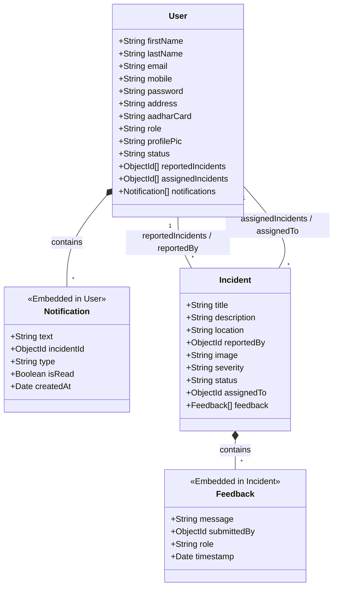

# 🚨 Incident Reporting System

A comprehensive, role-based Incident Reporting and Management System built using the MERN stack. The main goal is to provide a transparent workflow where incidents can be reported, reviewed, assigned, and resolved with clear accountability. 

Users can report incidents and track their progress. Admins manage user verification and assign incidents to appropriate authorities. Authorities handle the assigned incidents, update their status, and communicate through an embedded feedback thread.

## 🌟 Key Features

### 👤 User Features
- **Authentication**: Sign up & Login with JWT Auth (HTTP-only cookies).
- **Report Incidents**: Submit incidents with an image upload, severity level, location, and description.
- **Track Incidents**: View a dashboard of their reported incidents and current statuses.
- **Feedback**: Submit feedback on incidents (useful for communication with authorities).
- **Notifications**: Receive real-time updates when an incident is assigned, status is changed, or feedback is given.
- **Profile Management**: Edit profile details, change password, and upload a profile picture.

### 🛡️ Authority Features
- **Dashboard**: View incidents assigned to them by the Admin.
- **Status Updates**: Change the incident status (`under review`, `in progress`, `resolved`, `dismissed`).
- **Communication**: Send and reply to feedback on specific incidents.
- **Notifications**: Get real-time or offline email notifications for new assignments.

### 🔑 Admin Features
- **User Management**: Approve, reject, or verify newly registered users. Remove users if necessary.
- **Global Overview**: View all reported incidents across the system.
- **Delegation**: Assign incidents to specific authorities for resolution.
- **Monitoring**: Receive notifications when a new incident is reported. Monitor system activity.

## 🛠️ Tech Stack

### Frontend
- **React.js (Vite)**: Lightning-fast development environment.
- **Zustand**: Global state management.
- **Tailwind CSS & DaisyUI**: Utility-first CSS framework with pre-designed components.
- **React Router DOM**: Client-side routing.
- **Socket.io-client**: For real-time notifications.
- **Chart.js & React-Chartjs-2**: For analytics and dashboards.
- **Axios**: HTTP client.
- **Framer Motion**: Animations.

### Backend
- **Node.js & Express.js**: Server environment and web framework.
- **MongoDB & Mongoose**: NoSQL database and object data modeling.
- **JWT**: Authentication using secure HTTP-only cookies.
- **Socket.IO**: WebSockets for instant, real-time push notifications.
- **BullMQ & Redis**: Background job processing queue (used for resilient notification delivery).
- **Nodemailer**: Email delivery for offline users.
- **Cloudinary & Multer**: Cloud-based storage and middleware for processing multipart/form-data (profile pics, Aadhaar cards, incident images).

## 🏗️ Architecture & Database Schema

The system uses an optimized NoSQL schema utilizing MongoDB subdocuments. 
- **Notification** and **Feedback** are embedded directly into their parent documents (`User` and `Incident`) to reduce database lookups and maintain atomicity.



## 📬 Notifications System (Real-time & Offline)

The notification system uses a hybrid approach to guarantee delivery:
1. **Real-time**: When an event occurs (e.g., status update), the backend emits a Socket.IO event. If the user is connected, they receive the notification instantly in their UI.
2. **Background Processing (BullMQ + Redis)**: Notification tasks are added to a BullMQ queue. A worker processes these jobs asynchronously.
3. **Email Fallback**: If the user is offline (determined via active socket connections), the worker falls back to sending an email via Nodemailer. This ensures critical updates are never missed.

## 📂 Folder Structure

```text
/project-root
│
├── backend
│   ├── config/          # DB, Cloudinary, Redis configurations
│   ├── controllers/     # Request handlers
│   ├── middleware/      # Auth & Multer middlewares
│   ├── models/          # Mongoose Schemas (User, Incident)
│   ├── queues/          # BullMQ queue definitions
│   ├── routes/          # Express API routes
│   ├── utils/           # Helpers (sendNotification, email templates, etc.)
│   ├── workers/         # BullMQ background workers
│   └── server.js        # Entry point
│
└── frontend
    ├── src/
    │   ├── components/  # Reusable UI components
    │   ├── pages/       # Route-level components
    │   ├── stores/      # Zustand state stores
    │   ├── utils/       # Utility functions
    │   └── App.jsx      # Main application component
    └── vite.config.js
```

## ⚙️ Environment Variables

Create a `.env` file in the `backend/` directory:

```env
PORT=5000
MONGO_URI=your_mongodb_connection_string
JWT_SECRET=your_jwt_secret_key

# Cloudinary Setup
CLOUDINARY_CLOUD_NAME=your_cloud_name
CLOUDINARY_API_KEY=your_api_key
CLOUDINARY_API_SECRET=your_api_secret

# Redis Setup (Required for BullMQ)
REDIS_HOST=127.0.0.1
REDIS_PORT=6379

# Nodemailer Setup (Gmail or other SMTP)
EMAIL_USER=your_email@gmail.com
EMAIL_PASS=your_app_password

# Frontend URL for CORS
CLIENT_URL=http://localhost:5173
```

## ▶️ Installation & Setup

1️⃣ **Clone Repository**
```bash
git clone https://github.com/your-username/incident-reporter.git
cd incident-reporter
```

2️⃣ **Start Redis Server**
Make sure you have Redis installed and running locally, or use a managed Redis instance.
```bash
redis-server
```

3️⃣ **Backend Setup**
```bash
cd backend
npm install
npm start
```

4️⃣ **Frontend Setup**
```bash
cd ../frontend
npm install
npm run dev
```

## 🔐 API Routes Overview

### Authentication & General User Routes
- `POST /api/auth/signup` - Register a new user
- `POST /api/auth/login` - Authenticate user & set JWT cookie
- `POST /api/auth/logout` - Clear JWT cookie
- `GET /api/auth/me` - Auto-login using HTTP-only cookie
- `POST /api/auth/report-incident` - Submit a new incident
- `GET /api/auth/notifications` - Retrieve user notifications
- `POST /api/auth/submit-feedback` - Submit incident feedback

### Admin Routes
- `GET /api/admin/registrations` - List pending users
- `POST /api/admin/verify-user` - Approve/Reject users
- `GET /api/admin/users` - View all verified users
- `POST /api/admin/assign-incident` - Assign incident to an Authority

### Authority Routes
- `GET /api/authority/incidents` - List incidents assigned to the authority
- `POST /api/authority/update-status` - Update an incident's progress status